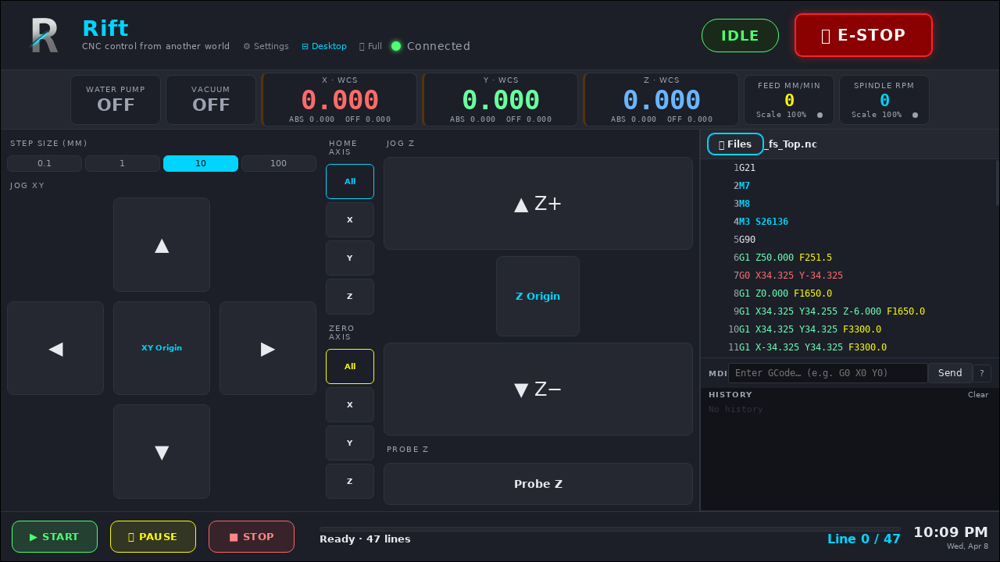

# Rift CNC UI

**Custom control interface for the Onefinity CNC — by AlienWoodshop LLC**

Rift replaces the stock Onefinity web UI with a fast, dark-themed control panel built for real shop use. It runs entirely in your browser — phone, tablet, or desktop — with no app to install on your end.

---

## Kiosk Mode vs Remote Browser

Rift runs in two modes depending on how you access it:

**Kiosk Mode** — when opened directly on the Pi's connected display (localhost). The layout is optimized for a touchscreen mounted at the machine: larger buttons, no 3D viewer, compact sidebar with jog controls front and center.



**Remote Browser Mode** — when opened from any other device on the network (phone, tablet, laptop). Full layout with the 3D toolpath viewer, GCode panel, and wider settings modal. This is the recommended mode for monitoring and setup.

---

## Features

- **Full DRO** — WCS + ABS positions for X, Y, Z at a glance
- **Jog controls** — XY pad + Z column with configurable step sizes
- **3D toolpath viewer** — G0/G1/G2/G3 arc support via Three.js *(remote browsers only — disabled in kiosk mode)*
- **GCode viewer** — syntax highlighting with live line tracking during a job
- **File manager** — upload, drag-and-drop, folder support
- **Start / Pause / Stop / E-Stop** — with confirmation dialogs where it counts
- **Progress bar** — time remaining and ETA during a job
- **Water pump + vacuum toggles** — relay control from the DRO bar
- **Settings modal** — motor tuning, tool config, I/O indicators, WiFi, system clock, firmware update, and more
- **Kiosk mode** — optimized layout for a Pi-connected touchscreen
- **Dark + light theme** — persisted per browser
- **Revert to stock anytime** — one button, no tools required

---

## Requirements

- Onefinity CNC running **bbctrl 1.6.6** (BuildBotics controller)
- A browser on the same network (Chrome, Firefox, Safari, Edge)

---

## Before You Install — Back Up Everything

> **Do not skip this step.** Your controller configuration contains your motor tuning, travel limits, tool settings, and homing parameters. If these are lost, your machine will not run correctly and re-entering them from scratch is tedious and error-prone.

### Back up your controller config (do all three)

**1. Download a full backup from the stock UI**
In the stock Onefinity interface: **Settings → Admin → Backup** — download the `.json` file and save it somewhere safe (not just your Downloads folder — copy it to a USB drive, cloud storage, or email it to yourself).

**2. Screenshot every settings page**
Open **Settings** in the stock UI and screenshot every tab — Motor X, Motor Y, Motor Z, Tool, and any custom values you've set. If a backup restore ever fails, these photos are your safety net.

**3. Write down your soft limits and motor steps**
Specifically: travel limits (min/max for X, Y, Z), steps/mm for each axis, max velocity, and max acceleration. These are the values that will brick your machine if wrong.

**Keep your backup somewhere you can find it in 6 months.** A Google Drive folder named "CNC Backups" with the date in the filename (`onefinity-backup-2026-04-08.json`) is a good habit.

Once Rift is installed, you can restore your config any time via **Settings → System → Import Backup**.

---

## Installation

### Option A — Firmware Update (Recommended)

No SSH, no tools. Done in under a minute.

1. **Download** the latest Rift firmware package:
   👉 **[rift-cnc-ui-v1.3.0.tar.bz2](https://github.com/DRSwanger/rift-cnc-ui/releases/download/v1.3.0/rift-cnc-ui-v1.3.0.tar.bz2)**

2. Open your Onefinity controller in a browser (usually `http://onefinity.local` or your machine's IP)

3. Go to **Settings → Admin → Software Update**

4. Click **Choose File**, select the downloaded `.tar.bz2`, and click **Update**

5. Wait ~30 seconds for the controller to reboot — then hard-refresh your browser

That's it. Rift is now your controller UI.

---

### Option B — SSH Deploy (Developers)

If you're developing or want zero-downtime updates:

```bash
git clone https://github.com/DRSwanger/rift-cnc-ui.git
cd rift-cnc-ui
SSH_PASS=bbmc ./deploy-ssh.sh
```

The script auto-discovers the bbctrl HTTP directory and backs up the original `index.html` before replacing it.

---

## Reverting to Stock Onefinity 1.6.6

Rift includes a one-click revert:

1. Download the official Onefinity 1.6.6 firmware from Onefinity's website
2. In Rift: **Settings → Firmware → Revert to Stock 1.6.6**
3. Select the downloaded `.tar.bz2` — the controller installs it and reboots

Everything is restored: the stock UI, splash screens, and all defaults.

---

## Running the Local Proxy (Optional)

Rift can be served from any machine on your network using the included proxy:

```bash
# Default (auto-detects controller at 192.168.1.130)
python3 proxy.py

# Custom controller IP
CNC_HOST=192.168.1.xxx python3 proxy.py
```

Then open `http://<your-machine-ip>:8888` in any browser.

---

## Project Structure

```
index.html          — Full UI (single file, zero dependencies except Three.js CDN)
proxy.py            — Local WebSocket + HTTP proxy for cross-origin access
deploy-ssh.sh       — SSH-based deploy to Pi (no bbctrl restart needed)
build_firmware.sh   — Packages index.html as a bbctrl-compatible .tar.bz2
manifest.json       — PWA manifest
rift-boot.png       — Boot splash screen
rift-shutdown.png   — Shutdown splash screen
scripts/            — Pi install helpers
```

---

## Known Limitations

- Resume-from-stop is implemented but disabled pending further testing (`ENABLE_RESUME = false`)
- Macro buttons are implemented but disabled pending the editor UI (`ENABLE_MACROS = false`)
- Rotary (4th axis) functionality is in progress and not yet enabled by default
- Automatic tool changer (ATC) workflow is in progress and not yet enabled by default

---

## License

© 2026 AlienWoodshop LLC. All rights reserved.

You may install and use Rift on your own machine for personal, non-commercial use. Redistribution, resale, sublicensing, or incorporation into any commercial product or service is prohibited without explicit written permission from AlienWoodshop LLC.

---

---

<a href="https://www.buymeacoffee.com/AlienWoodshop" target="_blank"></a>

*Rift by AlienWoodshop LLC — CNC control from another world.*
