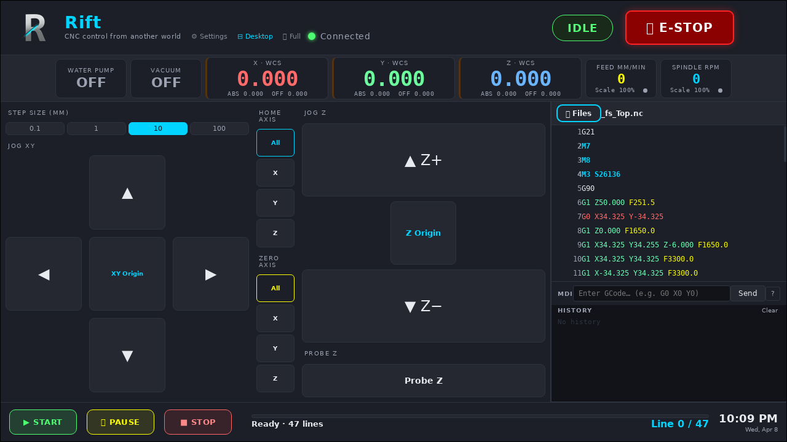
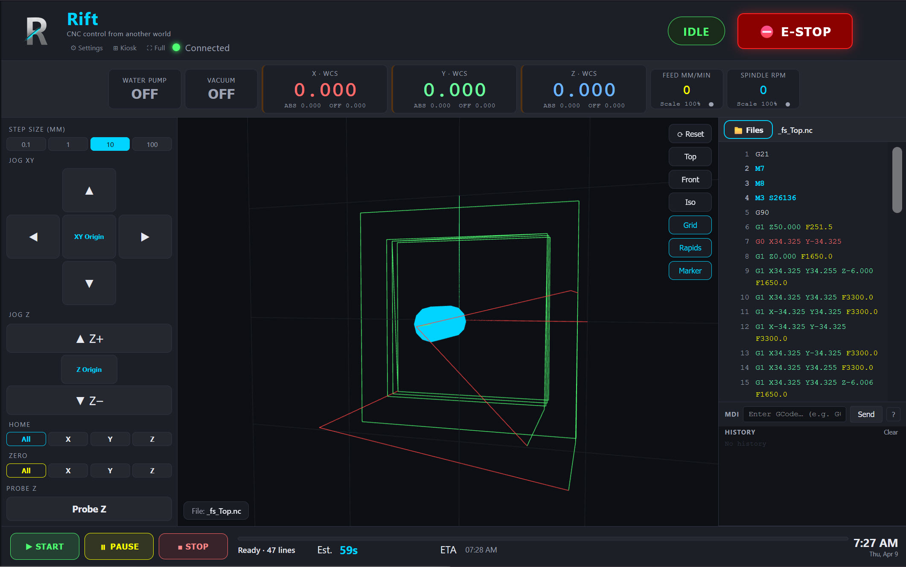

# Rift CNC UI

**Custom control interface for the Onefinity CNC — by AlienWoodshop LLC**

Rift replaces the stock Onefinity web UI with a fast, dark-themed control panel built for real shop use. It runs entirely in your browser — phone, tablet, or desktop — with no app to install on your end.

---

## Kiosk Mode vs Remote Browser

Rift runs in two modes depending on how you access it:

**Kiosk Mode** — when opened directly on the Pi's connected display (localhost). The layout is optimized for a touchscreen mounted at the machine: larger buttons, no 3D viewer, compact sidebar with jog controls front and center.



**Remote Browser Mode** — when opened from any other device on the network (phone, tablet, laptop). Full layout with the 3D toolpath viewer, GCode panel, and wider settings modal. This is the recommended mode for monitoring and setup.



📸 **[Full screenshot tour →](docs/screenshots.md)**

---

## Features

### Control
- **Full DRO** — WCS + ABS positions for X, Y, Z at a glance
- **Jog controls** — XY pad + Z column with configurable step sizes; every jog is unit-safe (explicit G21/G20)
- **Start / Pause / Stop / E-Stop** — with confirmation dialogs where it counts, and a header that never shifts under your finger (fixed-width state badge + E-Stop)
- **Water pump + vacuum toggles** — relay control from the DRO bar
- **Progress bar** — time remaining and ETA during a job

### Safety
- **Spindle power detection** *(optional, Settings → Tool)* — Rift watches the VFD's Modbus status and warns on Start when the spindle has no power (e.g. a physical spindle switch left off), instead of letting a job dry-run the tool through your material. Live indicator on the Spindle RPM card: green when the VFD responds, red **OFF** when it doesn't.
- **Soft-limit pre-flight** — before Start, the loaded file's extents are checked against machine travel (WCS-aware); jobs that would hit a limit are blocked with the numbers shown
- **Guarded settings** — Save writes controller config only from tabs that actually loaded; a UI-only save can never silently wipe motor or tool settings

### Visualize
- **3D toolpath viewer** — G0/G1/G2/G3 arc support via Three.js, live position tracking, cut-progress coloring, configurable color schemes *(remote browsers only — disabled in kiosk mode)*
- **GCode viewer** — syntax highlighting with live line tracking, virtualized so 100k-line trochoidal files scroll smoothly
- **Built for long jobs** — WebSocket updates are coalesced and rendering adapts to the tab's real speed, so hours-long carves don't freeze the browser (even on machines without GPU acceleration)

### Workflow
- **File manager** — upload, drag-and-drop, folder support
- **Movable panels** — drag panels between columns, resize sections with splitters; layout persists per browser with one-click reset
- **Settings modal** — motor tuning, tool config, I/O indicators, WiFi, network, system clock, and more
- **Update manager** — stable and nightly channels, checks GitHub for new releases and links directly to the download
- **Kiosk mode** — optimized layout for a Pi-connected touchscreen
- **Dark + light theme** — persisted per browser
- **Controller watchdog** — a background service restarts bbctrl if the web UI ever stops responding (installed automatically with the firmware package)
- **Rift branding end-to-end** — favicon and app icons served from the controller, so bookmarks and home-screen installs look right
- **Revert to stock anytime** — one button, no tools required

---

## Requirements

- Onefinity CNC running **bbctrl 1.6.6** (BuildBotics controller)
- A browser on the same network (Chrome, Firefox, Safari, Edge)

---

## Before You Install — Back Up Everything

> **Do not skip this step.** Your controller configuration contains your motor tuning, travel limits, tool settings, and homing parameters. If these are lost, your machine will not run correctly and re-entering them from scratch is tedious and error-prone.

### Back up your controller config (do all three)

**1. Download a full backup from the stock UI**
In the stock Onefinity interface: **Settings → Admin → Backup** — download the `.json` file and save it somewhere safe (not just your Downloads folder — copy it to a USB drive, cloud storage, or email it to yourself).

**2. Screenshot every settings page**
Open **Settings** in the stock UI and screenshot every tab — Motor X, Motor Y, Motor Z, Tool, and any custom values you've set. If a backup restore ever fails, these photos are your safety net.

**3. Write down your soft limits and motor steps**
Specifically: travel limits (min/max for X, Y, Z), steps/mm for each axis, max velocity, and max acceleration. These are the values that will brick your machine if wrong.

**Keep your backup somewhere you can find it in 6 months.** A Google Drive folder named "CNC Backups" with the date in the filename (`onefinity-backup-2026-04-08.json`) is a good habit.

Once Rift is installed, you can restore your config any time via **Settings → System → Import Backup**. Your controller config (motors, limits, tool) is separate and restored through the controller's own settings.

---

## Installation

### Option A — Firmware Update (Recommended)

No SSH, no tools. Done in under a minute.

1. **Download** the latest Rift firmware package:
   👉 **[rift-cnc-ui-v1.3.8.tar.bz2](https://github.com/DRSwanger/rift-cnc-ui/releases/download/v1.3.8/rift-cnc-ui-v1.3.8.tar.bz2)**

2. Open your Onefinity controller in a browser (usually `http://onefinity.local` or your machine's IP)

3. Go to **Settings → Admin → Software Update**

4. Click **Choose File**, select the downloaded `.tar.bz2`, and click **Update**

5. Wait ~30 seconds for the controller to reboot — then hard-refresh your browser

That's it. Rift is now your controller UI.

### Updating Rift

Once installed, Rift checks for updates automatically. Open **Settings → Firmware** — if a newer version is available it will show the release notes and a link to download the package. Install it the same way as the initial install via **Manual Upload**.

### Previous Versions

All historical releases are available on the [GitHub Releases page](https://github.com/DRSwanger/rift-cnc-ui/releases). Each release includes the firmware package and release notes. You can roll back to any prior version using the same Manual Upload process.

---

### Option B — SSH Deploy (Developers)

If you're developing or want zero-downtime updates:

```bash
git clone https://github.com/DRSwanger/rift-cnc-ui.git
cd rift-cnc-ui
SSH_PASS=bbmc ./deploy-ssh.sh
```

The script auto-discovers the bbctrl HTTP directory and backs up the original `index.html` before replacing it.

---

## Reverting to Stock Onefinity 1.6.6

Rift includes a one-click revert:

1. Download the official Onefinity 1.6.6 firmware from Onefinity's website
2. In Rift: **Settings → Firmware → Revert to Stock**
3. Select the downloaded `.tar.bz2` — the controller installs it and reboots

Everything is restored: the stock UI, splash screens, and all defaults.

---

## Troubleshooting — Install or Update via `curl`

If the in-UI updater fails (CORS issue on older builds, browser quirks, frozen UI, etc.), you can push any `.tar.bz2` package directly to the controller's bbctrl API. This works regardless of which UI version is installed (Rift or stock) — it's a built-in bbctrl endpoint.

**Install or update Rift:**

```bash
curl -X PUT -F "firmware=@rift-cnc-ui-v1.3.8.tar.bz2" http://<pi-ip>/api/firmware/update
```

**Revert to stock Onefinity 1.6.6:**

```bash
curl -X PUT -F "firmware=@onefinity-1.6.6.tar.bz2" http://<pi-ip>/api/firmware/update
```

Replace `<pi-ip>` with the controller's address — `onefinity.local` works on most networks (it's the mDNS hostname stock Onefinity controllers ship with), or use the IP directly (e.g. `192.168.1.130`) if mDNS isn't available. Run from the directory containing the `.tar.bz2`. The `firmware=@<file>` field name is required. The controller installs the package and reboots in ~30 seconds.

### "The PUT returned `ok` but the controller still shows the old version"

**Symptom:** `curl -X PUT ... /api/firmware/update` (or the in-UI Choose Package upload) returns `"ok"`, the controller reboots, but the version in **About** is unchanged. Hard-refreshing the browser doesn't help.

**Root cause:** The PUT was truncated mid-upload. `update-bbctrl` extracted *some* of the tarball (enough to find `scripts/install.sh`) but `src/py/bbctrl/http/index.html` was missing from the partial extract, so the `cp` step in `install.sh` failed and bbctrl restarted on the *old* `index.html`. The most common cause is a flaky wifi connection during the multipart upload. Older versions of `install.sh` exited silently here; v1.3.1-nightly.20260427.29+ now fails loudly with the message "ERROR: src/py/bbctrl/http/index.html missing from extracted package".

**Diagnose** — from any computer on the same network, check the version the controller is *actually serving*:

```bash
curl -s http://<pi-ip>/ | grep -m1 -oE "UI_VERSION[^,]*"
```

If that matches what you tried to install, it's just a browser cache — hard-refresh (Ctrl+F5 / Cmd+Shift+R) or open in incognito. If it shows the old version, the install really didn't take.

**Recover** — from a root shell on the Pi (plug in monitor + keyboard, or SSH if you know the password), pull the tarball server-side and install manually. This avoids the upload entirely:

```bash
sudo bash -c '
TAG=v1.3.8  # or any release tag
URL="https://github.com/DRSwanger/rift-cnc-ui/releases/download/${TAG}/rift-cnc-ui-${TAG}.tar.bz2"
WORK=/tmp/rift-debug
rm -rf "$WORK" && mkdir -p "$WORK" && cd "$WORK"
curl -fLso pkg.tar.bz2 "$URL" && \
tar xjf pkg.tar.bz2 && \
cd cnc-ui-custom && \
bash ./scripts/install.sh && \
systemctl restart bbctrl
'
```

**Prevent** — when `curl`-PUT is the only option, use a wired connection if possible, or test the PUT once with a small known-good tarball before relying on it for a real install.

---

## Running the Local Proxy (Optional)

The included `proxy.py` server unlocks features that aren't available when accessing the controller directly — push notifications, shared settings across browsers, combined backup/restore, and more.

See **[Local Proxy — Setup & Features →](docs/screenshots.md#local-proxy--setup--features)** for full details and instructions.

---

## Project Structure

```
index.html          — Full UI (single file, zero dependencies except Three.js CDN)
proxy.py            — Local WebSocket + HTTP proxy for cross-origin access
deploy-ssh.sh       — SSH-based deploy to Pi (no bbctrl restart needed)
build_firmware.sh   — Packages index.html as a bbctrl-compatible .tar.bz2
manifest.json       — PWA manifest
favicon.ico         — Rift favicon (served from the controller root)
rift-icon-*.png     — App icons for PWA / home-screen installs
rift-boot.png       — Boot splash screen
rift-shutdown.png   — Shutdown splash screen
scripts/            — Pi install helpers + bbctrl watchdog service
```

---

## Known Limitations

- Resume-from-stop is implemented but disabled pending further testing (`ENABLE_RESUME = false`)
- Macro buttons are implemented but disabled pending the editor UI (`ENABLE_MACROS = false`)
- Rotary (4th axis) functionality is in progress and not yet enabled by default
- Automatic tool changer (ATC) workflow is in progress and not yet enabled by default

---

## License

© 2026 AlienWoodshop LLC. All rights reserved.

You may install and use Rift on your own machine for personal, non-commercial use. Redistribution, resale, sublicensing, or incorporation into any commercial product or service is prohibited without explicit written permission from AlienWoodshop LLC.

---

---

<a href="https://www.buymeacoffee.com/AlienWoodshop" target="_blank"></a>

*Rift by AlienWoodshop LLC — CNC control from another world.*
