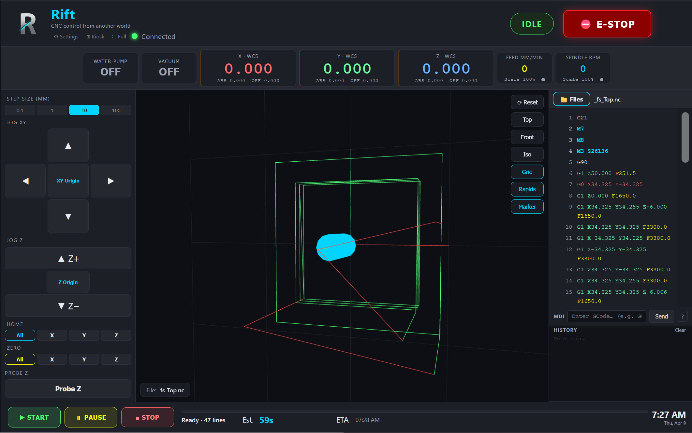
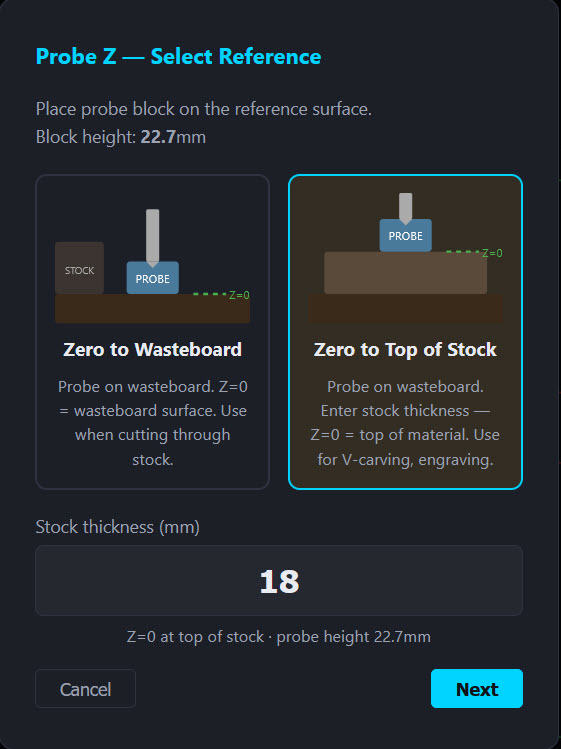
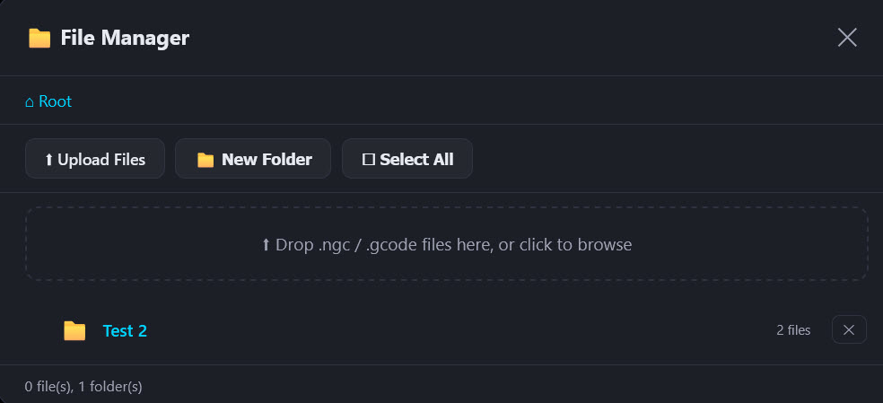
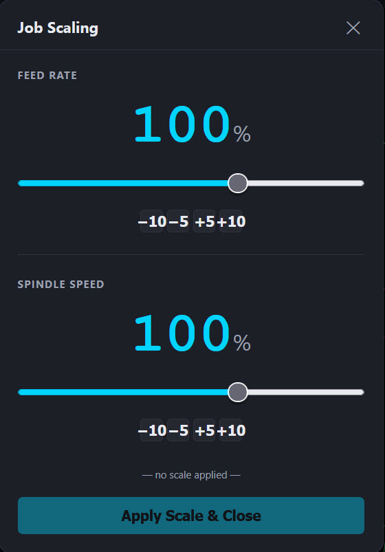
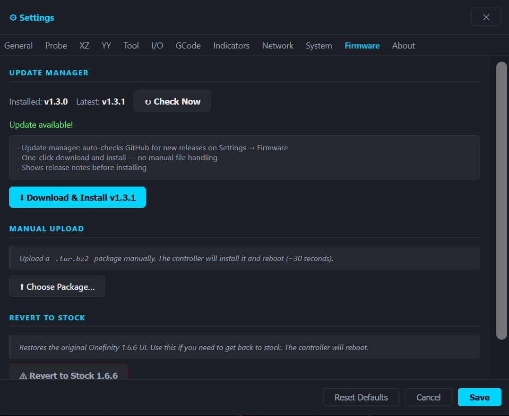

# Rift — Screenshots & Feature Tour

A visual walkthrough of the major features in Rift CNC UI.

---

## Kiosk Mode — Touchscreen Layout


Kiosk mode activates automatically when Rift is opened directly on the Pi's connected display (localhost). The layout is optimized for a touchscreen mounted at the machine — larger tap targets, jog controls front and center, and the 3D viewer is disabled to keep the Pi's CPU free for motion control.

---

## Main Interface — 3D Toolpath Viewer



The main control view with the 3D toolpath viewer active. The viewer renders your entire toolpath before and during a job:

- **Green lines** — cutting moves (G1/G2/G3)
- **Red lines** — rapids (G0)
- **Cyan box** — stock boundary, calculated from your file's extents
- **Live tracking** — the current line highlights in the GCode panel on the right as the job runs

The GCode panel shows syntax-highlighted code with the active line always scrolled into view. You can switch between the **Files**, **3D**, and **G</code>** tabs at any time — switching to Files while a job is running does not interrupt it.

> **Note:** The 3D viewer is available in **remote browser mode only** (phone, tablet, laptop on the same network). It is automatically disabled in kiosk mode to keep the Pi's CPU free for motion control.

---

## Probe Z — Reference Selection



The Probe Z workflow guides you step-by-step through setting your Z zero before a job. When you tap **Probe Z** on the main screen, this dialog appears first to confirm your reference method.

### Zero to Wasteboard
Place the probe block on the **wasteboard surface**. Z=0 will be set at the wasteboard. Use this when:
- Cutting through stock (the cut will reach the wasteboard)
- You want a consistent Z reference across multiple jobs on the same spoilboard

### Zero to Top of Stock
Place the probe block on **top of your material**. Enter the stock thickness — Rift calculates the wasteboard position automatically, and Z=0 is set at the top face of the material. Use this for:
- V-carving and engraving (toolpaths reference the top surface)
- Inlays and joinery where top-of-stock zero is expected

The probe block height is pulled from your Settings → Probe configuration and confirmed on screen. After selecting your method, tap **Next** — the controller will perform the probe move automatically, retract, and set Z=0 at the correct position.

---

## File Manager



The file manager handles uploading and organizing GCode on the controller's storage. Open it by tapping the folder icon on the main screen.

### Uploading files
- **Drag and drop** `.ngc` or `.gcode` files directly into the dashed drop zone
- Or tap **Upload Files** to open a standard file browser
- Multiple files can be uploaded at once

### Folders
- Tap **New Folder** to create a folder, then name it
- Navigate into a folder by tapping it
- The breadcrumb at the top (**Root → folder name**) shows your current location — tap any level to go back
- Delete a folder with the **×** button (only available when the folder is empty)

### Selecting a file to run
Tap any file to select it. The filename appears in the footer of the main screen and the GCode viewer loads its contents. The 3D viewer will render the toolpath automatically.

---

## Job Scaling



The Job Scaling dialog lets you adjust feed rate and spindle speed **while a job is running** — no need to stop, edit, and restart. Open it by tapping the feed rate or spindle RPM display in the DRO bar during a job.

### Controls
- **Slider** — drag to set a percentage from ~10% to 200%
- **±5 / ±10 buttons** — tap for precise incremental adjustments
- Tap **Apply Scale & Close** to confirm

### How it works
bbctrl has no live feed override API, so Rift handles scaling by rewriting the GCode directly. When you tap **Apply Scale & Close**, Rift rewrites every `F` value in the loaded file at the selected percentage and uploads it as a temporary scaled file. That scaled file is what runs when you tap **Start**. When the job ends, the original unscaled file is automatically restored.

### Notes
- Spindle speed scaling only applies if your spindle is controlled via Modbus or PWM through the controller; manually-set routers are unaffected
- The dot indicator on the Feed/Spindle cards turns yellow when a scale is pending (set but not yet applied) and green when a scaled file is loaded and ready
- Setting feed rate below ~10% may cause stalls on some moves — use caution

---

## Settings — Firmware & Update Manager



The Firmware tab in Settings handles everything related to the Rift version running on your controller. Open it via **Settings → Firmware**.

### Update Manager
When you open the Firmware tab, Rift automatically checks GitHub for the latest release. The installed version and latest available version are shown side by side.

- If you're up to date, it shows a green confirmation
- If an update is available, the release notes appear and a **link to the GitHub releases page** is shown for downloading the new package
- Tap **Check Now** to re-check manually at any time

### Manual Upload
Install any `.tar.bz2` firmware package — Rift releases or official Onefinity firmware — by uploading it directly:
1. Download the package to your device
2. Tap **Choose Package...**
3. Select the `.tar.bz2` file
4. The controller installs it and reboots automatically (~30 seconds)
5. Hard-refresh your browser after reboot

### Revert to Stock
If you ever want to go back to the original Onefinity 1.6.6 interface:
1. Download the official Onefinity 1.6.6 firmware from Onefinity's website
2. Tap **Revert to Stock 1.6.6**
3. Select the downloaded `.tar.bz2`
4. The controller installs it and reboots — everything is restored, including stock splash screens

---

## Local Proxy — Setup & Features

The included `proxy.py` server is an optional but recommended addition, especially if you access Rift from multiple devices or want push notifications. It runs on any machine on your network (a spare PC, another Pi, etc.) and acts as a bridge between your browser and the Onefinity controller.

### Why use the proxy?

When you access the controller directly at `http://onefinity.local`, the browser talks to the Pi's built-in web server (bbctrl / Tornado). This works fine for basic use, but has limitations:

| Feature | Direct access | Via proxy |
|---|---|---|
| Basic control & jog | ✅ | ✅ |
| 3D viewer & GCode | ✅ | ✅ |
| Probe/motor settings sync across browsers | ✅ (stored in controller config) | ✅ |
| UI preferences sync across browsers (theme, step sizes, labels) | ❌ (per-browser localStorage) | ✅ (shared `ui-settings.json`) |
| Combined backup (controller + UI settings) | ❌ | ✅ |
| Push notifications (ntfy.sh) | ❌ | ✅ |
| GitHub update check (no CORS error) | ❌ | ✅ |
| Action log | ❌ | ✅ |

### Requirements

- Python 3.7+
- `aiohttp` library: `pip3 install aiohttp`
- The machine running the proxy must be on the same network as the Onefinity controller

### Starting the proxy

```bash
# Clone the repo (if you haven't already)
git clone https://github.com/DRSwanger/rift-cnc-ui.git
cd rift-cnc-ui

# Default — expects controller at 192.168.1.130
python3 proxy.py

# Custom controller IP
CNC_HOST=192.168.1.xxx python3 proxy.py

# Custom port (default is 8888)
PORT=9000 python3 proxy.py
```

Then open `http://<proxy-machine-ip>:8888` in any browser on your network. The proxy serves the Rift UI and transparently forwards all WebSocket and API traffic to the controller.

### Keeping it running

To run the proxy in the background and survive reboots, use a systemd service or a simple `screen` / `tmux` session:

```bash
# Quick background run (exits when terminal closes)
nohup python3 proxy.py &

# Persistent with screen
screen -S rift-proxy
python3 proxy.py
# Ctrl+A then D to detach
```

### Push notifications via ntfy.sh

The proxy can send push notifications to your phone for key events — job start, job complete, E-stop, errors. It uses [ntfy.sh](https://ntfy.sh), a free and open-source push notification service.

**Setup:**
1. Install the ntfy app on your phone ([iOS](https://apps.apple.com/app/ntfy/id1625396347) / [Android](https://play.google.com/store/apps/details?id=io.heckel.ntfy))
2. Subscribe to a topic — use something unique, like `yourname-cnc`
3. Start the proxy with your topic:

```bash
NTFY_TOPIC=yourname-cnc python3 proxy.py
```

That's it. The proxy will send a notification whenever:

| Event | Notification | Priority |
|---|---|---|
| Job started | CNC Job Started | Normal |
| Job stopped | CNC Job Stopped | Normal |
| Job complete | CNC Job Complete | High |
| E-Stop triggered | 🚨 E-STOP | Urgent |
| E-Stop cleared | E-Stop Cleared | Low |
| Controller error | CNC Error | High |

The default topic is `alienwoodshop-cnc` if no `NTFY_TOPIC` is set. **Change this** — anyone who knows the topic name can subscribe to it.

### Shared settings & backup

Settings in Rift are split into two categories:

- **Controller config** (probe dimensions, motor tuning, tool settings) — saved directly to the Pi via the bbctrl API. These sync across all browsers automatically regardless of whether you use the proxy, because every browser reads from the same controller.
- **UI preferences** (theme, step sizes, output labels, etc.) — when using the proxy, these are stored server-side in `ui-settings.json` and shared across all browsers. Without the proxy, they fall back to each browser's own `localStorage` and are not shared.

The **Settings → System → Full Backup** option (when using the proxy) downloads a single `.zip` containing both your controller config and your Rift UI settings. Restore brings both back in one step.

---

*Back to [README](../README.md)*
